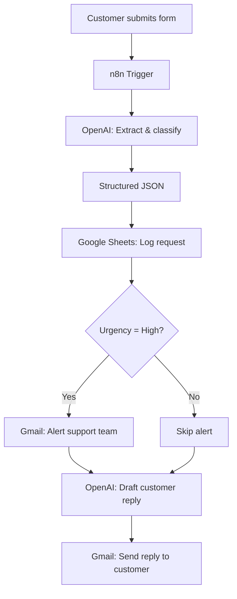

# AI-Powered Customer Support Automation

An end-to-end n8n workflow that reads incoming customer requests, uses the OpenAI API to classify and extract structured data from them, logs every request to Google Sheets, escalates urgent issues to the support team, and automatically sends a professional AI-drafted reply back to the customer — all without human intervention.

## Overview

Customers submit a request through a simple form. From there, the workflow:

1. Receives the submission via an n8n Form/Webhook trigger.
2. Sends the message to OpenAI, which extracts structured fields: **category, customer name, urgency, issue, and recommended action**.
3. Logs that structured data as a new row in Google Sheets.
4. Checks the urgency level — if it's **High**, sends an alert email to the support team.
5. Uses OpenAI again to draft a professional, context-aware reply.
6. Sends that reply to the customer via Gmail.

## Workflow Diagram



## Tech Stack

| Tool | Role |
|---|---|
| **n8n** | Workflow orchestration and automation engine |
| **OpenAI API** | Request classification and reply generation |
| **Google Sheets** | Structured logging / lightweight ticket tracker |
| **Gmail** | Automated customer replies and internal support alerts |

## Example

**Customer message:**
> "Hi, I've been trying to reset my password for two days and still can't access my account. I have an important meeting tomorrow."

**AI-extracted output:**

```json
{
  "category": "Account Access",
  "customer_name": "Jane Doe",
  "urgency": "High",
  "issue": "Password reset failure",
  "recommended_action": "Escalate to IT support"
}
```

**Result:** the request is logged to Google Sheets, a high-urgency alert is fired to the support team, and the customer receives a courteous reply confirming their case has been escalated.

## Repository Contents

- **`AI Customer Support Automation.json`** — the exported n8n workflow. Import it directly into n8n (Workflows → Import from File) to run it yourself.
- **`screenshots/n8n workspace.png`** — the full workflow canvas, showing all nodes and connections.
- **`screenshots/Google Sheets Data.png`** — the Google Sheet output with structured request data.
- **`screenshots/Generated email towards Support.png`** — example high-urgency alert sent to the support team.
- **`screenshots/Generated email towards customer (user).png`** — example AI-generated reply sent to the customer.

## Setup

1. Import `AI Customer Support Automation.json` into your own n8n instance.
2. Add your own credentials for OpenAI, Google Sheets, and Gmail (Credentials tab in n8n — nothing sensitive is stored in this repo).
3. Replace the placeholder email addresses in the Gmail nodes with your own support/test address.
4. Point the Google Sheets node at a spreadsheet of your own with matching column headers (`Timestamp`, `Customer`, `Category`, `Urgency`, `Issue`, `Recommended Action`).
5. Activate the workflow and submit a test request through the form.

## What This Project Demonstrates

- LLM/API integration for unstructured-to-structured data extraction
- Prompt design for both classification and natural-language generation tasks
- Conditional business logic (urgency-based routing)
- Multi-tool orchestration across Sheets and Gmail
- End-to-end automation design without a traditional backend

## Author

**Ahoura Minaeian**
